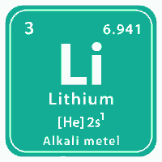

# Lithium Integrations

A companion mod to [Picklock](https://mods.factorio.com/user/t_picklock)'s [Factorio](https://factorio.com/) Mod [Lithium Polymer Accumulator](https://mods.factorio.com/mod/PicksLiPoAccu).  Its purpose is to provide integrations of the new Lithium ore type (and associated products) introduced by Picklock to other mods, making them part of recipes for more advanced items.  This gives the player more reasons to mine and refine Lithium.

## Changes to Base Mod

* Enable using productivity modules in crafting various lithium and graphite intermediate products
* Enable alternate recipes for creating graphite, including using petroleum gas, lubricant, light oil, or crude oil

## Supported Mod Integrations

* [Electric Weapons](https://mods.factorio.com/mod/Electric-Weapons) - Replaces regular batteries in recipes with lithium polymer cells
* [Advanced Solar HR](https://mods.factorio.com/mod/Advanced-Electric-Revamped-v16) - Updates various recipes to replace regular accumulators with lithium polymer accumulators, regular batteries with lithium polymer cells, and adds the cells as inputs to solar panels
* [Advanced Equipment](https://mods.factorio.com/mod/advanced-equipment) - Updates various recipes to use lithium polymer cells.  Disables the Battery MK3 item.

## Mod Settings

This mod has the following configurable startup settings.

* Enable alternate recipes for graphite - This setting enables alternate recipes for graphite, including using petroleum, lubricant, light oil, or crude oil.  Default: true
* Enable use of productivity modules for graphite and lithium items - This setting enables the use of productivity modules for recipies of graphite and lithium based items.  Default: true
* Enable Electric Weapons Integration - This setting enables integration with the Electric Weapons mod.  Default: true
* Enable Advanced Electric Integration - This setting enables integration with the Advanced Electric mod.  Default: true
* Enable Advanced Equipment Integration - This setting enables with the Advanced Equipment mod.  Default: true

## Acknowledgments

* [Picklock](https://mods.factorio.com/user/t_picklock) - For his excellent mod that provided the base for this mod
* [MFerrari](https://mods.factorio.com/user/MFerrari) - For his excellent Electric Weapons mod
* [LsHallo](https://mods.factorio.com/user/LsHallo) - For his excellent Advanced Solar HR mod
* [solyomd](https://mods.factorio.com/user/solyomd) - For his excellent Advanced Equipment mod
* [ZwerOxotnik](https://mods.factorio.com/user/ZwerOxotnik) - Select files borrowed from ZwerOxotnik's excellent [factorio-example-mod](https://github.com/ZwerOxotnik/factorio-example-mod)
* [blakemw](https://mods.factorio.com/user/blakemw) - Select code borrowed from blakemw's excellent [EnableProductivityModules](https://mods.factorio.com/mod/EnableProductivityModules) mod
